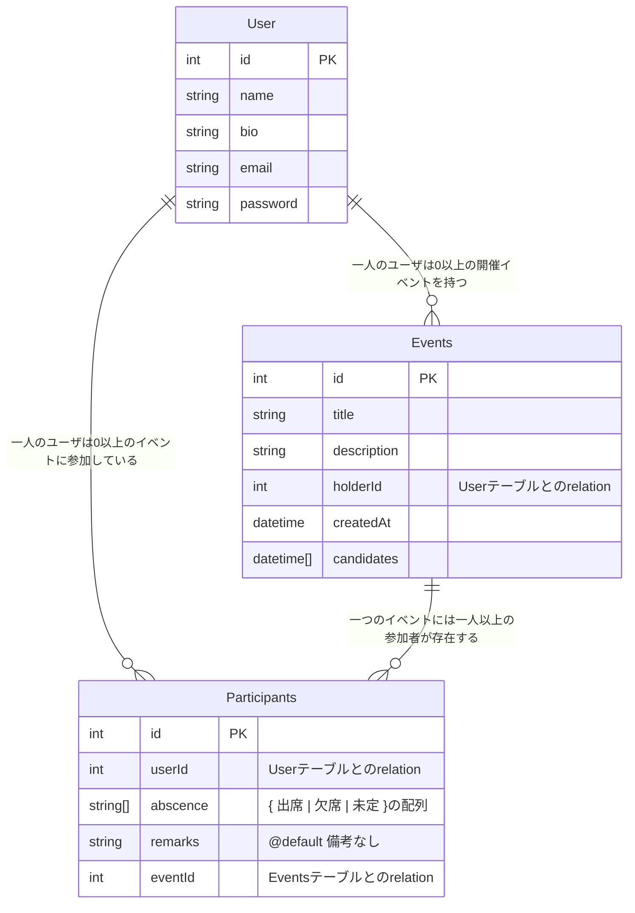
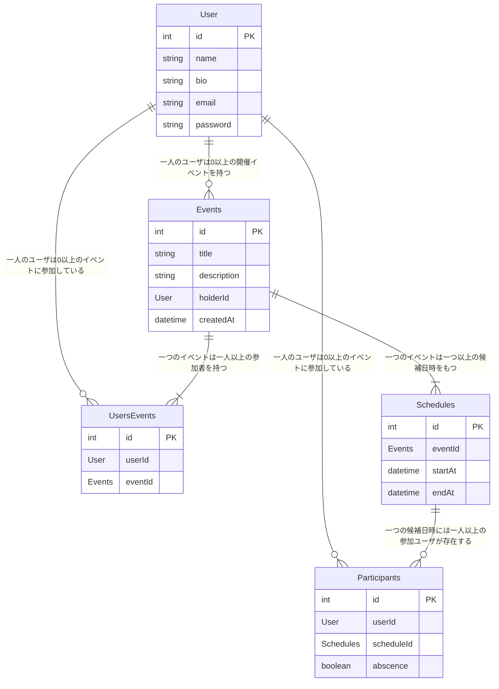

# 最終的なER図

最終的には上のような図となった。これにより各ページでは以下のように一つのPKのみで必要なデータを全て取得できるようになった。
* 参加中のイベント一覧画面
    * userIdを利用してParticipantsテーブルからuserIdが一致する行のみを抽出してくれば良い。
    * これに付随してEventsテーブルの情報も同時に取得することができる

* ユーザが開催中のイベント一覧画面
    * userIdを利用してUserテーブルでuserIdが一致する行を抽出してくれば良い
    * これに付随してEventsテーブルの情報も同時に取得することができる

* イベント詳細画面
    * eventIdを利用してEventsテーブルからEventに関連する情報を取得できる
    * 付随してUserテーブルから開催者情報を取得
    * 付随してParticipantsテーブルから出席情報と備考情報を取得
    * Participantsテーブルを経由して、Userテーブルから参加者名を取得
    * 出席情報の更新にはParticipantIdを元にabscence配列を変更すれば良い

* プロフィール画面
    * userIdを利用してUserテーブルからユーザ情報を取得
    * 編集後もuserIdを利用してUserテーブルの対象の行にアクセスしてデータを更新

### 改善点ポイントのまとめ
* 最初のDB設計に比べて、テーブルの数が明らかに少なくなったことがわかる。
* その代わりに、出席情報や候補日時情報を配列データとして圧縮している
* ポイントは**一つテーブルにアクセスすれば、直接他のテーブルにもすぐにアクセスすることができる設計**になっていることだと思う。

# 改善前のER図

これが最初のDB設計の状態である。テーブルが多く複雑に絡み合っていることがわかる。このテーブル設計だと実際にページを実装する際に問題が生じたり手続きが面倒になったりする。ここでは、実際に問題が生じるイベント詳細画面でのデータ取得について考える。

* イベントタイトル・説明・開催者情報の取得
    * eventIdを元にまずEventsテーブルにアクセスして、タイトル・説明を取得
    * 付随してholderIdを元にUserテーブルにアクセスして開催者情報を取得
* イベントの候補日時情報
    * eventIdを元にSchedulesテーブルでイベントに該当する行を全て抽出する
* 参加者の出席情報の取得
    * 先ほど取得したShedulesの各行のscheduleIdを元にParticipantsテーブルにアクセスして各候補日時での参加者の出席情報を取得する（この時点でだいぶ面倒だし怪しい）
* 参加者名の取得
    * 先ほど取得したParticipantsテーブルの各行のuserIdを元にUserテーブルにアクセスして取得する。
    * ここで、取得してくるデータには重複が生じてしまう。これは、一人のユーザーが同じイベントに対して複数の出席情報を持つことによる
    * これはSchedulesテーブルにおいてeventIdとstartedAt,endAtを合わせれば主キーになるのに、SchedulesテーブルにはidというPKがすでに設定されており、<mark>一つのテーブルに複数の主キー（PK）</mark>が存在することが原因だと考えられる。

* 出席情報の更新
    * 出席情報を更新するには各候補日時でのparticipantIdを取得して複数回同じ操作を行なって、Participantsテーブルに対して更新処理を行う必要がある。

### 改善するべきポイント
* データの取得は基本的に一つのPKを指定して一回で取得したいがこのように複数のテーブルが存在してPKが多いと何回もテーブルを経由する必要が出てきて処理が複雑になってしまう。
* データの更新も一つのPKで更新データを全て送って一度で更新処理できるようにするべき。何度も同じ処理を繰り返すとパフォーマンスも落ちるし、そもそも複数のPKをページ内で管理する必要があり非常に面倒

* 今回の設計で感じたDB設計のポイントは、各ページで取得できるPKを考えて、**そのPKひとつだけで一度に必要なデータ全てを取得できるようにテーブルおよびテーブルの関係を設計するということである**
